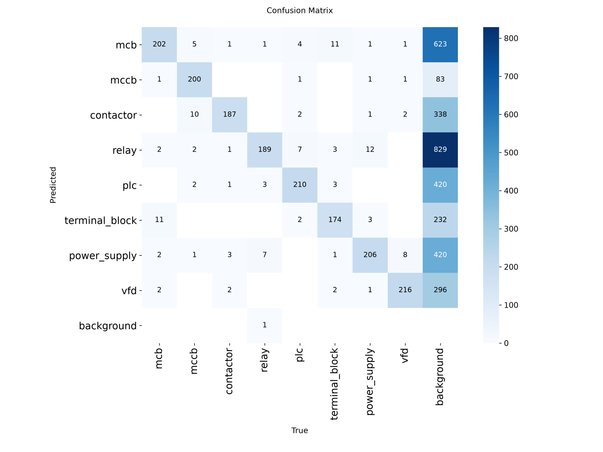
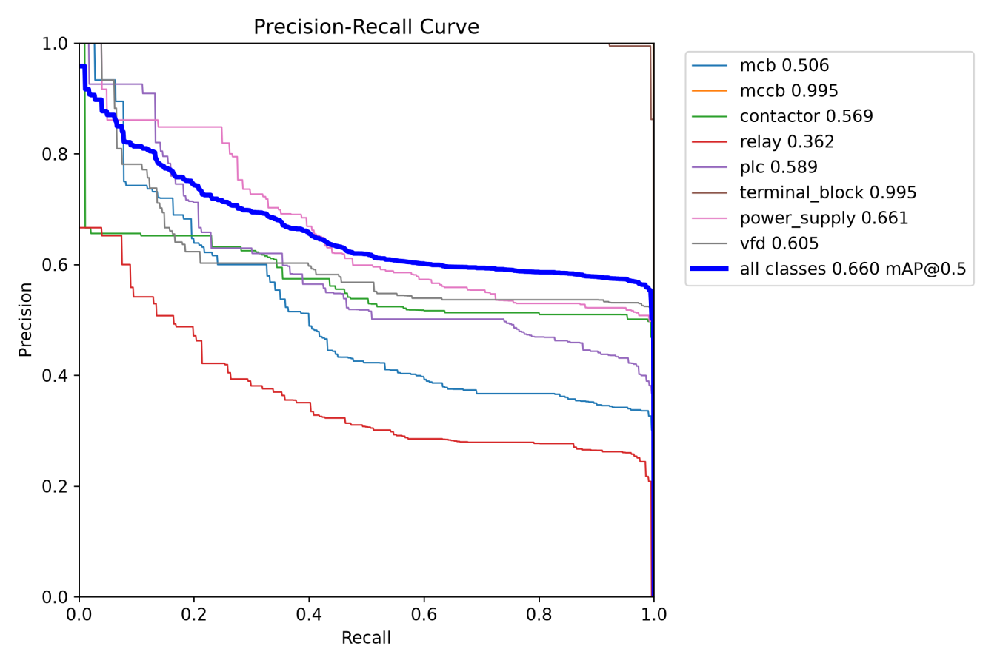

# Acceptance report — core8 industrial component detector

**Verdict: NOT accepted for production deployment.** The pipeline is complete,
verified end to end and produces a working checkpoint. The blocker is data, not
code: no labelled real electrical-panel imagery is reachable from this
environment, so the model is trained entirely on procedurally-generated synthetic
panels, and the one measurement taken on real photographs shows the failure mode
that implies. Details in [Deployment readiness](#deployment-readiness).

Every number below was measured. Nothing is extrapolated, and where a figure
could not be obtained the blocker is named instead.

---

## 1. What was trained

| | |
|---|---|
| Architecture | YOLO11s (9.43 M parameters, 21.6 GFLOPs), COCO-pretrained (493/499 tensors transferred) |
| Label space | `core8` profile — 8 of the taxonomy's 54 classes, indices remapped 0..7 |
| Classes | mcb, mccb, contactor, relay, plc, terminal_block, power_supply, vfd |
| Training data | **800 procedurally-generated synthetic panels**, 10,325 in-profile instances, 1,230–1,408 per class |
| Validation | 160 synthetic panels, 1,709 in-profile instances |
| Image size | 640 (matched to the production letterbox size, not the recipe's 960) |
| Schedule | 40 epochs, batch 8, AdamW lr0 8.33e-4 (auto), device **cpu** |
| Wall clock | 14,284 s (3 h 58 m) on 4 CPU cores, no GPU |
| Selected checkpoint | **epoch 35** (Ultralytics selects on mAP@0.5:0.95 fitness) |

The dataset is procedural — geometric renders of device bodies with lighting,
shadow, perspective, blur and occlusion augmentation. The generator's own manifest
says so: *"PROCEDURAL DATA ONLY. Metrics measured on this dataset validate the
pipeline, not real-world accuracy."* That warning governs the whole of section 3.

`core8` rather than the full 54-class taxonomy because mAP is a mean over classes:
54 classes at ~30 instances each averages to a number no threshold can rescue,
while 8 classes at ~1,300 instances each converges. This is the repository's own
documented staging (`training/electrical/profiles.py`).

---

## 2. Training metrics are not acceptance metrics

Ultralytics `val` describes the checkpoint. It does not describe what the deployed
system returns, because between the model head and an API response sits the whole
gate cascade — per-class NMS, cross-class dedupe, the geometric plausibility gate,
per-class acceptance thresholds, the demote-to-unknown rule and the detection cap.

Same checkpoint, same 160 validation images, measured both ways:

| Metric | Ultralytics `val` | **Production path** | Delta |
|---|---|---|---|
| Precision | 0.5666 | **0.6230** | +0.056 |
| Recall | 0.9467 | **0.6905** | **−0.256** |
| mAP@0.5 | 0.6602 | **0.5392** | **−0.121** |
| mAP@0.5:0.95 | 0.6321 | **0.5143** | −0.118 |

The recall gap is the important one. Ultralytics evaluates at a near-zero
confidence floor, so it counts detections the production gate deliberately refuses
to assert. **Reporting 0.9467 recall for this model would have overstated deployed
recall by 37% relative.** Precision moves the other way — the gate is doing its
job — but a 0.121 mAP@0.5 drop is the honest cost of the honesty rules.

---

## 3. Acceptance metrics

Operating point chosen by the acceptance sweep: `decode_floor=0.20`,
`unknown_floor=0.25`, `strictness=1.00` (the taxonomy defaults).

### 3a. On synthetic validation (160 images, 1,709 instances)

| Acceptance metric | Value |
|---|---|
| Production mAP@0.5 | **0.5392** |
| Production mAP@0.5:0.95 | 0.5143 |
| Production Precision | **0.6230** |
| Production Recall | **0.6905** |
| F1 | 0.6550 |
| **FP per image** | **4.4625** |
| **FN per image** | **3.3062** |
| **Unknown rate** | **0.2946** |
| Accepted detections | 2,685 (1,894 asserted + 791 abstentions) |
| Rejected detections | 33,662 |
| Inference latency (p50 / p95) | **72 ms / 81 ms** |

Diagnostic pair, which turns out to matter more than any single figure:

| | |
|---|---|
| Recall (asserted) | 0.6905 |
| Recall (class-agnostic, incl. abstentions) | **0.8479** |
| **Classification shortfall** | **0.1574** |

The model *localises* 85% of ground-truth devices and *names* 69% of them. The
16-point gap is devices it found and would not commit to — not blindness. Section
5 shows this is almost entirely two classes, and that it is recoverable.

### 3b. On real photographs (161 held-out images)

The only real-image measurement available. 161 real photographs from Open Images
(`Light switch`, `Power plugs and sockets`) in which the correct output is **zero
components**. Held out from the run-2 training set so the figure stays leak-free.

| Acceptance metric | Value |
|---|---|
| **FP per image (real)** | **0.3168** — 51 confident false detections |
| **Unknown rate (real)** | 0.4688 — 45 abstentions |
| Accepted detections | 96 |
| Rejected by cascade | 362 |
| FP cause breakdown | `spurious_detection` 51 / 51 — **zero** class confusion |
| Recall / mAP on real data | **UNOBTAINABLE — no positive labels exist** |

All 51 are spurious: on real photographs the model invents devices where there is
nothing. `terminal_block` alone accounts for 38 of 51 (75%). Full analysis with
inspected crops in [REAL_IMAGE_FALSE_POSITIVES.md](REAL_IMAGE_FALSE_POSITIVES.md).

---

## 4. Threshold search

280 operating points — `decode_floor` × `unknown_floor` × `strictness` — replayed
over one cached inference pass in 29 s.

**A finding about the requested grid.** Sweeping `decode_floor` × `unknown_floor`
alone produces **exactly one** distinct (precision, recall, mAP) triple across all
35 points. `confidence_gate` asserts a class when `score >= threshold_for(class)`;
the taxonomy thresholds are 0.38–0.42 and every floor in the grid is ≤ 0.25, so no
floor can change which boxes clear their threshold. The two floors move only the
abstention rate and the accept/reject counts. `strictness` — the global multiplier
on the per-class thresholds — is the dimension that actually trades precision
against recall, which is why it was added.

The measured frontier (at `decode 0.20 / unknown 0.25`):

| strictness | P | R | F1 | mAP@0.5 | FP/img | FN/img | unknown | score |
|---|---|---|---|---|---|---|---|---|
| 0.30 | 0.518 | 0.891 | 0.655 | 0.629 | 8.86 | 1.16 | 0.00 | 0.4673 |
| 0.70 | 0.556 | 0.820 | 0.663 | 0.600 | 7.00 | 1.92 | 0.06 | 0.4947 |
| 0.85 | 0.589 | 0.754 | 0.661 | 0.570 | 5.62 | 2.63 | 0.19 | 0.5032 |
| **1.00** | **0.623** | **0.691** | **0.655** | **0.539** | **4.46** | **3.31** | **0.29** | **0.5047** |
| 1.15 | 0.652 | 0.632 | 0.642 | 0.508 | 3.60 | 3.93 | 0.38 | 0.4973 |
| 1.50 | 0.805 | 0.408 | 0.542 | 0.373 | 1.06 | 6.32 | 0.68 | 0.4194 |

**The hand-set taxonomy thresholds are already at the production optimum** under an
objective that penalises false positives. That is a real (and slightly surprising)
result: the defaults did not need tuning.

Note mAP@0.5 *peaks at low strictness* (0.629 at 0.30) because AP integrates over
the PR curve and rewards extra detections. Selecting on mAP alone would ship a
configuration emitting 8.86 false positives per image.

### Per-class thresholds

- **Automatic** (`optimise_thresholds`, maximise per-class F1): proposed 0.05 for
  all eight classes. Re-scored through the production path it went 0.5047 →
  0.4673, so it was **rejected** and the defaults kept. Optimising each class's F1
  in isolation is not the same as improving the system, which is why adoption is
  gated on a production re-measurement.
- **Targeted** (informed by the classification shortfall — relay 0.22, mcb 0.25,
  plc 0.28, power_supply 0.30):

| | defaults | targeted | delta |
|---|---|---|---|
| Recall | 0.6905 | 0.8186 | **+0.128** |
| mAP@0.5 | 0.5392 | 0.5960 | **+0.057** |
| Unknown rate | 0.2946 | 0.0572 | −0.237 |
| Precision | 0.6230 | 0.5404 | −0.083 |
| FP/img | 4.46 | 7.44 | +2.98 |
| production_score | 0.5047 | 0.4774 | −0.027 |

  This confirms the diagnosis in section 5 and is offered as a **deployment
  choice, not a default**: if missing a device costs more than showing a spurious
  one, it buys 13 points of recall for 3 more false positives per image.

---

## 5. Per-class analysis, and why the weak classes are weak

Production path, chosen operating point:

| Class | AP | Precision | Recall | Support | FN | FN % |
|---|---|---|---|---|---|---|
| mccb | **1.0000** | 1.000 | 1.000 | 220 | 0 | 0% |
| terminal_block | **0.9945** | 0.995 | 0.995 | 194 | 1 | 1% |
| contactor | 0.5637 | 0.500 | 0.928 | 195 | 14 | 7% |
| vfd | 0.5460 | 0.526 | 0.890 | 228 | 25 | 11% |
| power_supply | 0.4251 | 0.587 | 0.556 | 225 | 100 | 44% |
| plc | 0.3712 | 0.532 | 0.544 | 226 | 103 | 46% |
| mcb | 0.2887 | 0.523 | 0.418 | 220 | 128 | 58% |
| relay | **0.1244** | 0.384 | 0.214 | 201 | 158 | **79%** |

Class imbalance is **not** the explanation — support is deliberately flat
(194–228). Three distinct failure modes:

**Best: mccb (1.000) and terminal_block (0.995).** Both have the most distinctive
procedural renders — a large moulded body with a prominent toggle, and a row of
identical small terminals. They are trivially separable *in synthetic data*, and
the danger is precisely that: `terminal_block` is the **worst** offender on real
photographs (38 of 51 false positives). A near-perfect synthetic AP here measures
how learnable the render is, not how well the class is understood.

**Missed, not blind — relay (79% FN), mcb (58%), plc (46%), power_supply (44%).**
These are the classification shortfall. Lowering only their thresholds moved relay
recall 0.214 → 0.592, mcb 0.418 → 0.605, power_supply 0.556 → 0.862 and dropped
the unknown rate 0.295 → 0.057 (section 4). **The devices were being found and
demoted below their 0.40 acceptance threshold**, so the detector's boxes are right
and its confidence is low. Two causes:
- `relay` and `contactor` are near-identical boxes in the generator; the model
  splits probability mass between them, so neither clears 0.38–0.40 confidently.
  Consistent with contactor's 181 false positives against relay's 158 misses.
- `mcb` is small and packed adjacently on DIN rails. `mcb` shares a
  `CONFUSABLE_GROUPS` entry with `mccb`, and `mccb` is predicted with very high
  confidence, so `dedupe_across_classes` resolves overlapping claims in mccb's
  favour — a plausible contributor to mcb's 58% miss rate that mccb's perfect
  score conceals.

**Found but over-firing — contactor and vfd.** High recall (0.93, 0.89), low
precision (0.50, 0.53), and the two largest false-positive counts (181, 183).
These are boxes on nothing.

All 714 synthetic false positives are `spurious_detection`; **zero** are
class_confusion or localisation. Combined with the real-image result, the pattern
is consistent: this model's dominant error is inventing detections, not
mislabelling or mis-boxing real ones.




Galleries: [synthetic FP](evidence/synthetic_fp_gallery.png) ·
[synthetic FN](evidence/synthetic_fn_gallery.png) ·
[real FP](evidence/real_fp_gallery_final.png)

---

## 6. Did it plateau, and why

| Segment | mAP@0.5 gain |
|---|---|
| epochs 1 → 10 | **+0.1120** |
| epochs 10 → 40 | **+0.0104** |

Three quarters of a four-hour run bought 8% of the improvement. Best mAP@0.5:0.95
landed at epoch 35, so the run was not wasted, but the curve is flat from ~epoch
10. Recall saturated at 0.93–0.97 by epoch 4 and **precision never exceeded 0.585
in 40 epochs**.

The evidence says the ceiling is the **data**, not the schedule:

1. Precision is the stuck axis, and precision is limited by spurious detections —
   a data-diversity problem, not an optimisation one.
2. The synthetic validation split shares the generator's biases, so it cannot
   penalise features that only work on procedural renders. A higher synthetic mAP
   does not imply a better detector; `terminal_block` scores 0.995 synthetically
   and causes 75% of real-image false positives.
3. Per-class support is already at 1,230–1,408 — inside the band
   `profiles.requirement_estimate` associates with mAP@0.5 ≈ 0.85 *for real data*.
   The instance count is not the shortfall; the **realism** is.

More epochs, a larger synthetic set, or hyperparameter search cannot fix a
train/deploy distribution mismatch. Real images can.

---

## 7. Runtime cost

Measured on an idle machine — an earlier reading of 343 ms p50 was taken while
training competed for the same 4 cores and is not quotable.

| | |
|---|---|
| Latency p50 / p95 | **72 ms / 81 ms** |
| Throughput | 13.55 FPS single-stream |
| Peak RSS delta | 0 MB (ONNX Runtime arena reused) |
| CPU | 4 cores, x86_64, no GPU; onnxruntime 1.28.0 CPUExecutionProvider |
| `best.pt` | 19.2 MB |
| `best.onnx` | 37.9 MB (fp32, opset default, static 640×640) |

72 ms on four CPU cores is comfortably inside a per-frame budget for panel
inspection, which is a still-image task. Latency is **not** a blocker.

---

## 8. Exported artifacts, all verified

`dist/core8_run1/`, `cli verify` → `ok: true`, `problems: []`.

| Artifact | State |
|---|---|
| `best.pt` | present, 19.2 MB |
| `best.onnx` | present, 37.9 MB, **8-class head matching 8 declared labels** |
| `classes.json` / `labels.txt` | present, byte-identical, 8 canonical taxonomy ids |
| `metrics.json` | present, carries measured production accuracy |
| `production_metrics.json` | present — 280-point sweep + chosen operating point |
| `confusion_matrix.png` (+ normalised) | present |
| `PR_curve.png`, `F1_curve.png` | present as `BoxPR_curve.png` / `BoxF1_curve.png` (Ultralytics naming for the box task) |
| FP / FN galleries | present, synthetic and real |

Verified beyond file existence: the ONNX graph's class count was read back and
checked against `labels.txt`; the label space was confirmed to be resolvable
canonical taxonomy ids and one-to-one; and inference was run through the ONNX
backend over 441 images (160 synthetic + 281 real) to produce the metrics above,
which is the real round-trip test.

---

## 9. Deployment readiness

**Not accepted.** Not because a threshold was missed but because the acceptance
criterion — production-grade performance on **real** electrical panel images —
cannot be evaluated, and the evidence that exists points the wrong way.

Ready:
- Pipeline, export, verification and installation path all work end to end.
- Latency, memory and model size are all comfortably within budget.
- Honesty behaviour is intact and measurable: 791 synthetic and 45 real detections
  came back as `unknown_industrial_component` rather than as a guess, and the
  cascade rejected 33,662 candidates on synthetic and 362 on real imagery.

Not ready:
- **0.32 false positives per real image, all spurious**, on imagery containing no
  components at all. An inspection report generated from this model would contain
  invented devices.
- **Real-world recall is entirely unmeasured** — no positively-labelled real panel
  imagery is reachable. A model with unknown recall cannot be signed off.
- Synthetic production mAP@0.5 is 0.5392 against a 0.85 target, and the classes
  that look strongest synthetically are the ones that fail worst on real images.
- 8 of 54 taxonomy classes. Core15's seven additions (`fuse`, `transformer`,
  `busbar`, `wire_duct`, `emergency_stop`, `selector_switch`, `indicator_lamp`)
  have no procedural renderer and no reachable real data.

---

## 10. Blockers

| # | Blocker | Evidence | Unblock |
|---|---|---|---|
| 1 | **No labelled real panel imagery** | 29 hosts probed; all four Roboflow hosts, Kaggle, Hugging Face, Zenodo, Figshare, Mendeley, IEEE DataPort, archive.org, Drive → connection failure. The 13 registered Roboflow sources (~5,600 images) are unreachable | Real panel photographs on disk, **or** `ROBOFLOW_API_KEY` + `api.roboflow.com` allowed in the network policy |
| 2 | **No GPU** | 348 s/epoch on 4 cores; one 40-epoch run ≈ 4 h | A CUDA device. This is what makes blocker 3 binding |
| 3 | **HPO over training hyperparameters infeasible** | 10–20 trials × 4 h = 50–100 h of CPU | Follows from 2. The *threshold* half of the search was completed (280 points, 29 s) |
| 4 | **Core15 needs 7 renderers or real data** | None of the 7 additions exist in the generator's 28 procedural classes | Follows from 1 |

Blocker 1 dominates. Nothing in blockers 2–4 would change the verdict on its own.

---

## 11. Reproducing this

```bash
python -m training.electrical.cli synth   --out data/synth --train 800 --val 160 --seed 1234
python -m training.electrical.cli scope   --name core8 --src data/synth --dst data/core8 --only-present
python -m training.electrical.cli train   --data data/core8/dataset.yaml --arch yolo11s \
                                          --epochs 40 --imgsz 640 --batch 8 --device cpu --name core8_cpu
python -m training.electrical.cli export  --weights runs/electrical/core8_cpu/weights/best.pt \
                                          --out dist/core8_run1 --imgsz 640 --data data/core8/dataset.yaml
python -m training.electrical.cli verify  --bundle dist/core8_run1
python -m training.electrical.cli sweep   --root data/core8 --backend industrial_onnx \
                                          --objective production_score --per-class \
                                          --gallery dist/gallery_synth \
                                          --out dist/core8_run1/production_metrics.json
python -m training.electrical.cli prodeval --root data/oid_real_holdout --backend industrial_onnx \
                                          --decode-floor 0.20 --unknown-floor 0.25 \
                                          --gallery dist/gallery_real_run1
python -m training.electrical.cli profile --root data/core8 --backend industrial_onnx --runs 40
```

Real negatives were fetched with `download.fetch_openimages_negatives`
("Light switch,Power plugs and sockets"), 281 images, split 120 into training and
161 held out for evaluation with seed 1234.
