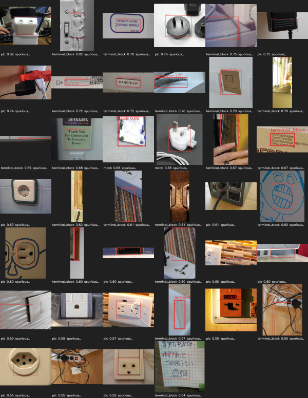

# What a synthetic-trained detector does on real photographs

This is the only measurement in this repository taken on **real images**, and it is
a negative result worth reading before trusting any synthetic mAP number.

## How the measurement was possible at all

Every dataset host carrying annotated electrical panels is unreachable from this
environment (see [DOMAIN_TRANSFER.md](DOMAIN_TRANSFER.md) for the full matrix).
Open Images is reachable, and while it has **no** industrial electrical class
among its 601 boxable classes, it does have `Light switch` and
`Power plugs and sockets`. Those give real photographs in which the correct output
of this detector is **zero components**.

281 such images were fetched with
`download.fetch_openimages_negatives` — the annotation CSVs streamed and filtered
rather than downloaded whole — and every label file is deliberately empty.

```bash
python -m training.electrical.cli prodeval \
  --root data/oid_real_negatives --backend industrial_onnx --split val \
  --decode-floor 0.05 --unknown-floor 0.18 --gallery dist/real_fp_gallery
```

What this can and cannot measure: **false positives per image and the unknown
rate, and nothing else.** There are no positive labels, so recall, mAP and
per-class AP are undefined on this set and are not reported.

## The result

Model: YOLO11s, core8 profile, trained on 800 procedurally-rendered synthetic
panels (epoch 7 checkpoint), evaluated through the production inference path.

| Metric | Value |
|---|---|
| Real images evaluated | 281 |
| Ground-truth components | 0 |
| **False positives per image** | **0.438** |
| Asserted (confident) false detections | 123 |
| Demoted to `unknown_industrial_component` | 248 |
| Unknown rate | 0.668 |
| Rejected by the gate cascade | 5,059 |

Every false positive was classified `spurious_detection` — **123 of 123**, with
zero `class_confusion` and zero `localisation`. That distinction matters: the
model is not mistaking one real device for another, and it is not drawing loose
boxes around real devices. On real photographs it invents devices where there is
nothing.

Two classes produce 89% of them:

| Class | False positives | Share |
|---|---|---|
| `plc` | 62 | 50% |
| `terminal_block` | 48 | 39% |
| `mccb` | 12 | 10% |
| `mcb` | 1 | 1% |
| contactor, relay, power_supply, vfd | 0 | — |

## Why — from the pixels, not from theory



Every crop in that sheet was inspected. **None of them is an unlabelled real panel
component** — they are wall sockets, plug pins, printed labels, wood grain, brick,
a ceramic figurine and a felt-tip doodle. So the empty labels are correct, and all
123 detections are true false positives rather than an artefact of missing
annotation. This inspection is also the reason the figure above can be quoted at
all: a negatives-only set cannot, by itself, tell a false positive from an
unlabelled device, so the crops had to be looked at.

The failures are systematic, and each traces directly to how the synthetic
generator draws that class:

- **`plc` fires on mains sockets and rectangular plastic fascias.**
  `synthetic.render_device` draws a PLC as a plain rectangular body with a row of
  small ports. A European or US socket faceplate is the same shape at the same
  scale with the same small dark apertures. The model learned *rectangle with
  small holes*, which is not what makes something a PLC.
- **`terminal_block` fires on any repeating horizontal texture.** It is rendered
  as a row of small identical rectangles, so brick courses, wood grain, tiled
  splashbacks and the rectangular outline of a printed label all satisfy it. Two
  of the highest-confidence detections in the sheet (0.82, 0.78) are text labels.
- **`mccb` fires on dark rectangular protrusions**, e.g. the pins of an unplugged
  moulded plug.
- **The four classes with rich internal structure — contactor, relay,
  power_supply, vfd — produced no false positives at all.** They are rendered
  with more distinguishing detail, so there is less for a generic rectangle to
  match.

The conclusion is uncomfortable but specific: on procedural data the model learned
**low-level shape and texture cues rather than device identity**, and the classes
whose renders are least distinctive are exactly the classes that hallucinate. A
higher synthetic mAP would not fix this, because the synthetic validation split
shares the generator's biases — it is the same rectangles.

## What the gate does, and what it cannot do

The cascade rejected 5,059 candidates on these 281 images:

| Stage | Rejected |
|---|---|
| `nms_same_class` | 4,088 |
| `below_unknown_floor` | 829 |
| `duplicate_class_claim` | 93 |
| `implausible_aspect_ratio` | 40 |
| `implausible_too_small` | 9 |

So the gate is doing substantial work, and the geometric plausibility priors do
catch real nonsense (49 boxes). But 123 detections still clear a ~0.4 per-class
threshold on images containing nothing. **Tightening thresholds is not the fix
here**: these are confident errors, some at 0.82, so the strictness needed to
suppress them would also suppress genuine detections. The honesty gate does help
in a measurable way — 248 further boxes came back as
`unknown_industrial_component` rather than as a named guess — but a 0.67 unknown
rate on blank imagery is itself noise the operator has to dismiss.

## What would actually fix it

In order of expected effect per unit of work:

1. **Real panel photographs with labels.** This is the whole of the problem. The
   requirement estimate in `profiles.requirement_estimate` puts the core8 profile
   at roughly 700–1,200 instances per class of *real* data for mAP@0.5 ≈ 0.85.
2. **Real hard negatives in training.** These 281 images are currently used only
   for evaluation. Adding them to the training set as negatives directly targets
   the observed failure — but note it teaches "socket is not a PLC" without
   teaching what a PLC is, so it reduces false positives without improving recall.
3. **More distinctive renders for `plc` and `terminal_block`**, if procedural data
   must be leaned on further. The evidence says these two renders are too generic;
   the four detailed renders produce no false positives.

Do not read the synthetic mAP in `metrics.json` as a field accuracy estimate. This
page is what the field looks like.
